# Indicadores Visuales para sonido

[](https://github.com/supyrb/ConfigurableShaders/releases)
[](https://unity3d.com/get-unity/download/archive)
---
## Descripción

Esta herramienta te permitirá generar indicadores visuales para aquellos objetos que emiten sonido te permitirá cambiar los colores del indicador, añadir iconos personalizados, y ajustar el tamaño, ya sea el del propio indicador o bien el tamaño estándar de estos.

## Guía de instalación

Para instalar este package sigue los siguientes pasos:

1. Descarga (PONER UN ENLACE DE DESCARGA).
2. Descomprime el archivo descargado.
3. Muévelo a una ubicación que tengas localizada, recomendamos que sea en la carpeta raíz del proyecto
```bash
<Game-root>
|-- Assets
|     |-- things inside Assets  
|
|-- Library
|     |-- things inside library 
|
|-- Logs
|     |-- things inside logs
|
|-- obj
|     |-- things inside obj
|
|-- Packages
|     |-- thigs inside Packages
|
|-- ProjectSettings
|     |-- things inside ProjectSettings
|
|-- Temp
|     |-- things inside temp  
|
|-- UserSettings
|     |-- things inside UserSettings
|
|-- Move the unzip package folder (com.g04.visualtool) HERE
|
```
4. Abre tu proyecto e importa el paquete
    
    1. Haz click en Window
    
        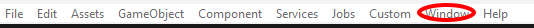

    2. En el desplegable selecciona PackageManager 
    
        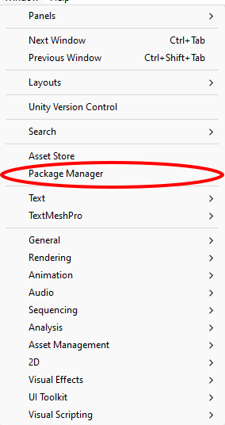

    3. En la ventana que se ha abierto haz click sobre el "+"

        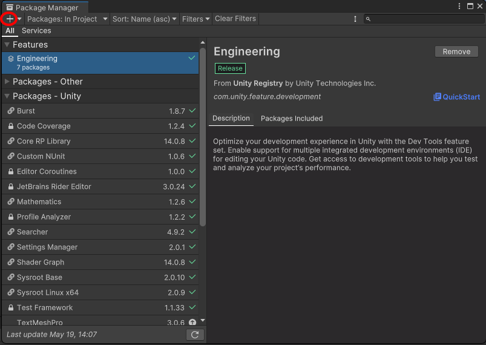

    4. De las opciones selecciona cargar package del disco

        
        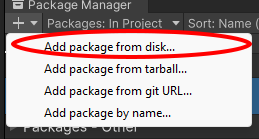

    5. Navega hasta la carpeta del paquete y carga el archivo llamado package.json
          
        

    6. Deja que el paquete se instale y haga sus configuraciones pertinentes

    7. Pueden ocurrir dos cosas o lo ha conseguido hacer solo o bien necesita ayuda
        
        * Todo ha ido bien, pasa al siguiente paso
        
         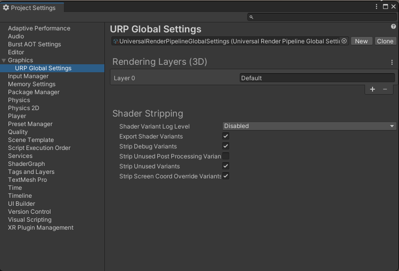

        * Requiere de ayuda pulsa en el botón Fix que aparece 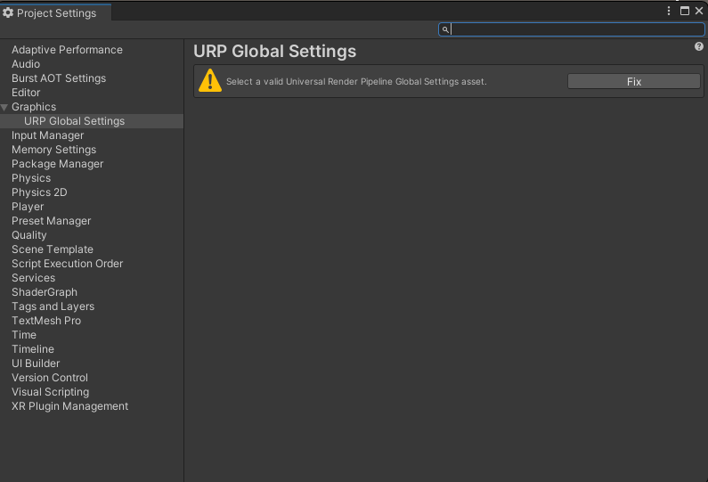

    8. Haz click en Window
    
        

    9. En el desplegable selecciona Rendering

        
        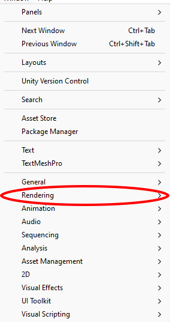

    10. En las opciones que figuran selecciona Render Pipeline Converter

        
        

    11. En la ventana que aparece en el desplegable asegurate que figura la opción Built-in to URP

        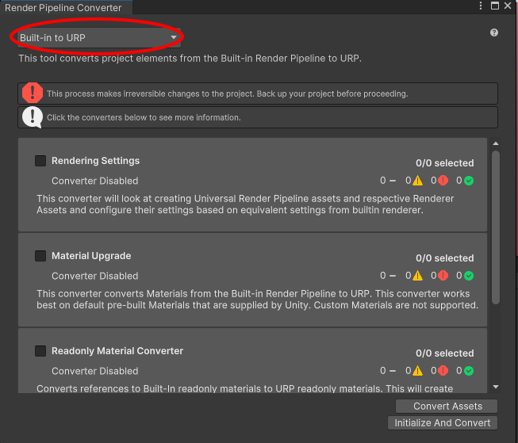

    12. Selecciona TODAS las opciones que aparecen (en la imagen no se aprecian todas las opciones)

        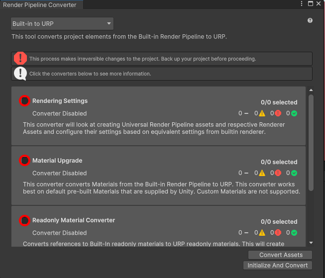

    13. Haz click en el botón de Initialize and Convert

        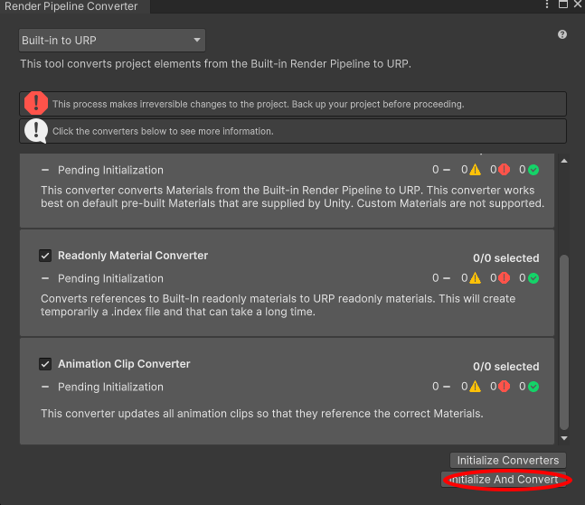


5.Listo ya puedes usar este paquete

Se debe tener en cuenta que la herramienta de manera automática te setea el valor del Render Pipeline que trae ella si se desea usar otro queda a responsabilidad del desarrollador que use la herramienta el cambiarlo y hacer los ajustes pertinentes.
## Guia de uso

Para usar esta herramienta se requiere que en la escena exista un objeto Canvas, recomendamos dentro de este crear otro objeto vacío en la posición que se desee que sea el centro del círculo que formarán los indicadores

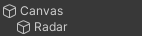 

A este objeto se le añadirá el script [Indicator Controller.cs](./Scripts/IndicatorController.md). En el editor aparecerá un slider, este slider representa el porcentaje de pantalla que deseas que ocupe el círculo que forman los indicadores, obtendrá la menor de las medidas de la pantalla y ese será el valor del diámetro del círculo(teniendo en cuenta el porcentaje seleccionado).

Además aparece un campo llamado Player que será el objeto que se quiere que haga de referencia para determinar la posición de los sonidos, ten en cuenta que lo hace detectan su Vector3.Right, por ello si necesita rotar su objeto de referencia(en el editor para ajustar) recomendamos que tenga un objeto padre vacío que sea el que contenga el script y el audio listener y como hijos tenga los objetos rotados para evitar posibles problemas.

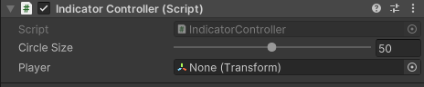

Por último todos los objetos que se desee que sus sonidos sean representados por los indicadores de la herramienta se les añadirá el script [Transmitter.cs](./Scripts/Transmitter.md).
Este componente posee bastantes campos modificables desde el editor.


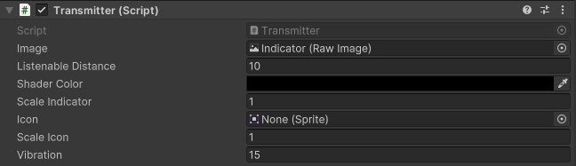

Vamos a describir qué significa cada uno de los campos
* **Image** Es la imagen del indicador viene definida por defecto intente no cambiarla, si la pierde podrá encontrarla en la carpeta del paquete/Runtime/Prefabs/Indicator.prefab

* **Listenable Distance** Determina cuál es la distancia máxima a la que se escucha el sonido y a partir de esa distancia dejará de aparecer el indicador

* **Shader Color** Elige el color que representará a ese objeto el alpha se calcula con respecto a la distancia entre el player seleccionado anteriormente y el objeto Transmitter en cuestión.

* **Scale Indicator** Factor por el que se multiplicará el tamaño estándar del indicador.

* **Icon** Es un Sprite, si no se pasa ninguna no añadirá icono, en caso de que si se añade aparecerá el icono en el indicador.

* **Scale Icon** Factor  por el que se multiplicará el sprite tanto en ancho y alto para respetar las dimensiones del sprite

* **Vibration** El indicador proporciona una vibración cuanto más bajo es el número en valor absoluto  más suave y armónica es esta, aunque si es 0 
