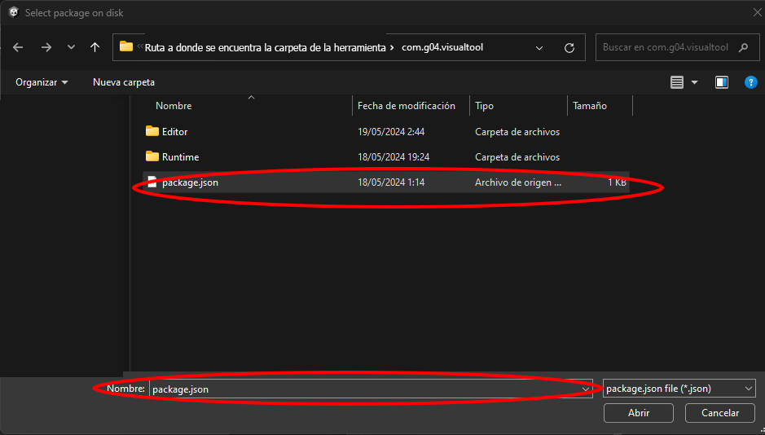
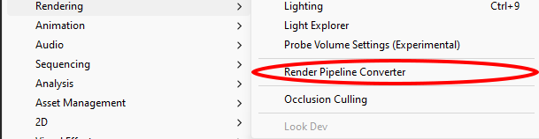
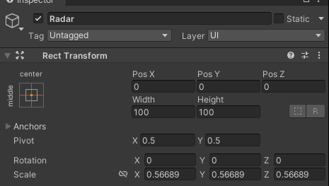

# Indicadores Visuales para sonido

Añadir un video/ imagen donde se vea la herramienta

(HACER RELEASE Y REPO PUBLICO)
[](https://github.com/supyrb/ConfigurableShaders/releases)
[](https://unity3d.com/get-unity/download/archive)
---
## Descripción

Esta herramienta te permitirá generar indicadores visuales para aquellos objetos que emiten sonido te permitirá cambiar los colores del indicador, añadirle iconos personalizados, y ajustar el tamaño, ya sea el del propio indicador o bien el tamaño estandar de estos.

## Guia de instalación

Para instalar este package sigue los siguientes pasos:

1. Descargarlo,(PONER UN ENLACE DE DESCARGA).
2. Descomprime el archivo descargado.
3. Muevelo a una ubicacion que tengas localizada, recomendamos que sea en el proyecto en la carpeta de Packages
```bash
<Game-root>
|-- Assets
|     |-- things inside Assets  
|
|-- Library
|     |-- things inside library 
|
|-- Logs
|     |-- things inside logs
|
|-- obj
|     |-- things inside obj
|
|-- Packages
|     |-- manifest.json
|     |-- package-lock.json
|     |-- Move the unzip package folder HERE
|
|-- ProjectSettings
|     |-- things inside ProjectSettings
|
|-- Temp
|     |-- things inside temp  
|
|-- UserSettings
|     |-- things inside UserSettings
|
|-- Other files
|
```
4. Abre tu proyecto e importa el paquete
    
    1. Haz click en Window
    
        

    2. En el desplegable selecciona PackageManager 
    
        

    3. En la ventana que se ha abierto haz click sobre el "+"

        

    4. De las opciones selecciona cargar package del disco

        
        

    5. Navega hasta la carpeta del paquete y carga el archivo llamado package.json
          
        

    6. Deja que el paquete se instale y haga sus configuraciones pertinentes

    7. Pueden ocurrir dos cosas o lo ha conseguido hacer solo o bien necesita ayuda
        
        * Todo ha ido bien, pasa al siguiente paso
        
         

        * Requiere de ayuda pulsa en el boton Fix que aparece 

    8. Haz click en Window
    
        

    9. En el desplegable selecciona Rendering

        
        

    10. En las opciones que figuran selecciona Render Pipeline Converter

        
        

    11. En la ventana que aparece en el desplegable asegurate que figura la opción Built-in to URP

        

    12. Selecciona TODAS las opciones que aparecen (en la imagen no se aprecian todas las opciones)

        

    13. Haz click en el boton de Initialize and Convert

        


5.Listo ya puedes usar este paquete

## Guia de uso

Para usar esta herramienta se requiere que en la escena exista un objeto Canvas, recomendamos dentro de este crear otro objeto vacio en la posicion que se desee que sea el centro del circulo que formarán los indicadores

 

A este objeto se le añadirá el script [Indicator Controller.cs](./Scripts/IndicatorController.md). En el editor aparecerá un slider este slider representa el porcentaje de pantalla que deseas que ocupe el circulo que formen los indicadores, obtendra la menor de las medidas de la pantalla y ese será el valor del diametro del circulo(teniendo en cuenta el porcenaje seleccionado).

Además aparece un campo llamado Receiver que será el objeto que se quiere que haga de referencia para determinar la posición de los sonidos, ten en cuenta que lo hace detectan su Vector3.Right, por ello si necesita rotar su objeto de referencia(en el editor para ajustar) recomendamos que tenga un objeto padre vacio que sea el que contenga el script y el audio listener y como hijos tenga los objetos rotados para evitar posibles problemas.


Por último todos los objetos que se desee que sus sonidos sean representados por los indicadores de la herramienta se les añadirá el script [Transmitter.cs](./Scripts/Transmitter.md).
Esta componente posee bastantes campos modificables desde el editor.


Vamos a describir que significa cada uno de los campos
* **Image** Es la imagen del indicador viene definida por defecto intente no cambiarla, si la pierde podrá encontrarla en la carpeta del paquete/Runtime/Prefabs/Indicator.prefab

* **Listenable Distance** Determina cual es la distancia maxima a la que se escucha el sonido y a partir de esa distancia dejara de aparecer el indicador

* **Shader Color** Elige el color que representará a ese objeto el alpha se calcula con respecto a la distancia entre el player seleccionado anteriormente y el objeto transmitter en cuestion.

* **Scale Indicator** Factor por el que se multiplicará el tamaño estandar del indicador.

* **Icon** Es un Sprite, si no se pasa ninguna no añadira icono, en caso de que si se añada aparecerá el icono en el indicador.

* **Scale Icon** Factor  por el que se multiplicara el sprite tanto en ancho y alto para respetar las dimensiones del sprite

* **Vibration** El indicador proporciona una vibracion cuanto mas bajo es el numero en valor absoluto  mas suave y armónica es esta, aunque si es 0 